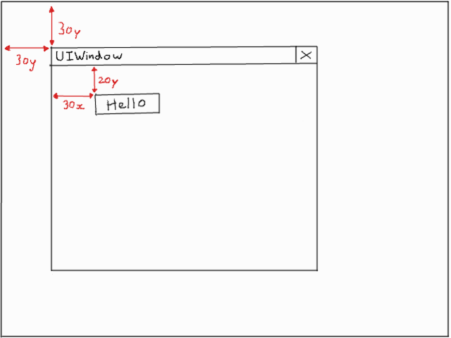
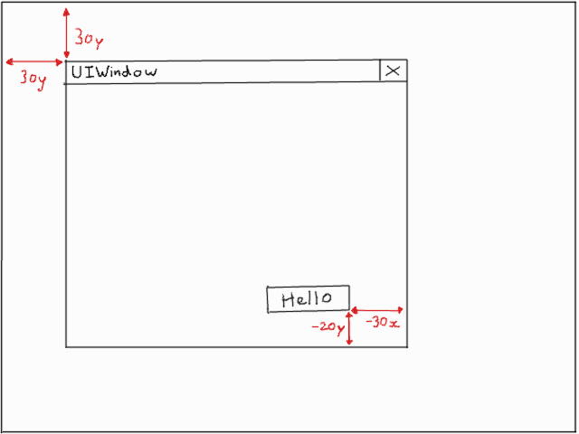
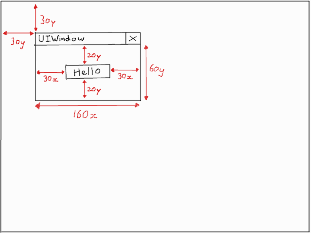
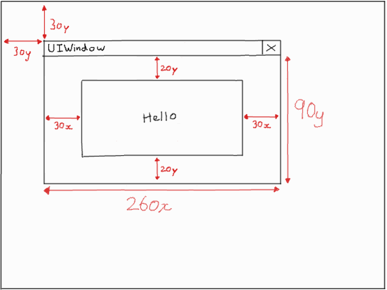

.. _layout-guide:

Layout Guide
============

Pygame GUI elements are positioned in three different axes - x (horizontal), y (vertical) and a layer.

Anchors were improved in Version 0.6.5, adding center anchors and removing the need to specify lots of anchors when
you only want to alter one.

Horizontal & Vertical positioning
---------------------------------

Just as in regular PyGame, the x and y axis used by Pygame GUI run from 0 in the top left corner down to the pixel
size of whatever surface/window you are positioning your elements on.

The standard way of positioning elements is through using a 'relative rectangle'; this rectangle's position is always
relative to the container it is inside of. If you do not supply a container when creating your element, they will be
assigned the default 'root container' which is created when you make the GUI's UI Manager and is the same size as the
supplied window_resolution parameter.

If you do supply a container when creating an element, by default it will normally be positioned relative to the top
left corner of the container. For example, if we were to position a 'hello' UIButton element inside of a UIWindow
container, and set its relative_rect parameter like so:

.. code-block:: python
   :linenos:

    button_layout_rect = pygame.Rect(30, 20, 100, 20)

    UIButton(relative_rect=button_layout_rect,
             text='Hello',
             manager=manager,
             container=ui_window)

You would get a result something like this:

The button would maintain its relative x and y position to the top left corner of the window it's contained inside
of, no matter where the window is moved to.

Layout Anchors
--------------

What if you don't want to position your element relative to the top left hand corner of a container? That's where
layout anchors come in. By changing the anchors for an element you change what the relative layout rectangle is
relative _to_.

The most straight forward use is to switch both layout axes to track different sides of the container. So, instead of
being relative to the top left we anchor to, let's say, the bottom right. That would look something like this:

.. code-block:: python
   :linenos:

    button_layout_rect = pygame.Rect(0, 0, 100, 20)
    button_layout_rect.bottomright = (-30, -20)

    UIButton(relative_rect=button_layout_rect,
             text='Hello', manager=manager,
             container=ui_window,
             anchors={'right': 'right',
                      'bottom': 'bottom'})

Note that both the left and right sides of the button are anchored to the right of our container, and both the top and
bottom are anchored to its bottom. This will keep the button the same size whatever size the container
is and will produce a layout looking a bit like this:

Another common use case of anchors is centering an element inside a container, in one dimension or both:

.. code-block:: python
   :linenos:

    button_layout_rect = pygame.Rect(0, 0, 100, 20)
    UIButton(relative_rect=button_layout_rect,
             text='Hello', manager=manager,
             container=ui_window,
             anchors={'center': 'center'})

When centering with an anchor, the normal left & top positions supplied to the element's relative rectangle are
adjusted to instead be an offset from center to center. This just makes it a little bit easier to handle these common
positions. Thus a rectangle position of (0, 0) as above will place the centre of the element in the center of the
container.

If you just want to center in the x dimension, or the y dimension, then the 'centerx' and 'centery' anchors
are what you need:

.. code-block:: python
   :linenos:

    button_layout_rect = pygame.Rect(0, -30, 100, 20)
    UIButton(relative_rect=button_layout_rect,
             text='Hello', manager=manager,
             container=ui_window,
             anchors={'centerx': 'centerx',
                      'bottom': 'bottom'})

Sometimes you want a layout to change size with its container so that we make maximum use of the available space. In
those cases we can simply set the appropriate axis anchors of our button to their counterparts on the window. So, to
stretch out the x axis (horizontal), set it as 'left' to 'left' and 'right' to 'right'. To stretch out the y axis (vertical),
set it as 'top' to 'top' and 'bottom' to 'bottom'. For example, here is a "hello button" with a stretch (both x & y axes) anchor
setup:

.. code-block:: python
   :linenos:

    button_layout_rect = pygame.Rect(30, 20, 100, 20)

    UIButton(relative_rect=button_layout_rect,
             text='Hello', manager=manager,
             container=ui_window,
             anchors={'left': 'left',
                      'right': 'right',
                      'top': 'top',
                      'bottom': 'bottom'})

Here's what it might look like placed in a small UIWindow:

And here's what happens to it when we resize the UIWindow to be a bit larger:

You'll notice the gaps between the edges of the window have been maintained.

Invalid anchors
-----------------

Some anchor combinations are currently invalid. For example, you can't set:

.. code-block:: python
   :linenos:

    button_layout_rect = pygame.Rect(0, 0, 100, 20)
    UIButton(relative_rect=button_layout_rect,
             text='Hello', manager=manager,
             container=ui_window,
             anchors={'left': 'right',
                      'right': 'left'})

Nor the similar inversion for 'top' and 'bottom'. Currently, the 'center' anchor can only be set to anchor to 'center',
and likewise with 'centerx' and 'centery'. These restrictions were made cleared in Version 0.6.5.

Anchor targets
--------------

What if you don't want to position elements relative to container edges, but relative to other elements inside the
container? For that we have anchor targets.

The first thing to appreciate about anchor targets is that because they are inside the container with the element being
positioned, rather than the element being inside of them, the sides we are anchoring to are reversed. For example,
anchoring the right hand side of our element to be positioned to the right of the container is straight forward,
but if we add an element as a 'right_target' we will actually anchor to the left hand side of this element, for the
purposes of positioning.

You might get some strange results if you mix up anchoring direction schemes and anchor targets, generally it is a good
idea to match the direction scheme of the element you are anchoring to.

Anchor targets are most useful when you have dynamically sized elements where you don't know how large the button next
to you is going to be but you know you want your right hand side to be ten pixels away from its left hand side.

Anchor targets are optional, don't add them if you don't want to use them and positioning will default to the
container edges. They are specified like this:

.. code-block:: python
   :linenos:

   button_3 = pygame_gui.elements.UIButton(relative_rect=pygame.Rect((-10, -40), (-1, 30)),
                                           text='Anchored', manager=manager,
                                           container=dynamic_dimensions_window,
                                           anchors={'bottom': 'bottom',
                                                    'right': 'right',
                                                    'bottom_target': button_1,
                                                    'right_target': button_2})

Dynamically sized elements
--------------------------

Certain elements, such as UIButtons, can have dynamic sizes where their size is determined by the contents (usually by
passing in -1). In these cases, positioning the top left in the relative rectangle should be done as if the dynamic
dimension was 0 length. When the dimension is eventually calculated it will be added into the positioning formula.

UI Layers
---------

UI Layers start at 0, which represents the lowest level, and progress upwards as they are needed. Things in higher
layers will be drawn on top of things in lower layers if they overlap.

Most of the time using Pygame GUI you do not have to interact too much with the layer system. UIs don't tend to
be designed with their interactive bits overlapping that often, and when they do they tend to be in windows.
The main exception is for groups of elements, used for things like HUDs which may overlap UI elements that appear
in game worlds (such as monster health bars). For these occasions there is the UIPanel element which works as a
container, much like a UI Window, except you specify what layer of the UI it will draw on (and thus what it will appear
on top of).

So, how do you know where to position your UI Panels? Well, for that purpose, and for any other time you might need to
utilize the layer system, there is a layer debug mode that you can activate by calling a function on the UI manager.
This should let you figure out how many layers are being used for your 'in-game' UI stuff and thus where to position
your Panel. Here's how to turn it on:

.. code-block:: python
   :linenos:

   ui_manager.set_visual_debug_mode(True)

It gives you information as a snapshot of the current state of the UI, so I recommend temporarily binding it to a
keypress - then you can toggle it on and off at different times in your game. It will not keep track of any changes
in the UI after being turned on.
