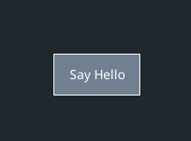
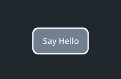

.. _quick-start-theming:

Quick Start Guide - Part 2: Theming
===================================

The first thing we need to do is create an empty theme file.

Open a new text file - call it what ever you like and save it with a .json extension. I use my IDE for this but a simple
text editor like windows notepad will also work. JSON is the `JavaScript Object Notation <https://en.wikipedia.org/wiki/JSON>`_
file format and commonly used for saving all types of data - in this case theming data - that we can then use across
multiple UI Elements.

Start with a simple outline for theming all "button" type elements - see below - inside your new json file

.. code-block:: json
   :caption: quick_start.json
   :linenos:

    {
        "button":
        {
        }
    }

Of course the file existing on it's own will not do anything - you will also need to load it into your UIManager. Paths
to theme files can either be absolute (starting from the drive location) or relative to the current working directory of
your script. Here's the modified quick_start.py file loading our 'quick_start.json' (or whatever you have called it)
theme file into the UIManager:

.. code-block:: python
   :linenos:
   :emphasize-lines: 13

    import pygame
    import pygame_gui

    pygame.init()

    pygame.display.set_caption('Quick Start')
    window_surface = pygame.display.set_mode((800, 600))

    background = pygame.Surface((800, 600))
    background.fill(pygame.Color('#000000'))

    manager = pygame_gui.UIManager((800, 600), theme_path="quick_start.json")

    hello_button = pygame_gui.elements.UIButton(relative_rect=pygame.Rect((350, 275), (100, 50)),
                                                text='Say Hello',
                                                manager=manager)

    clock = pygame.time.Clock()
    is_running = True

    while is_running:
        time_delta = clock.tick(60)/1000.0
        for event in pygame.event.get():
            if event.type == pygame.QUIT:
                is_running = False

             if event.type == pygame_gui.UI_BUTTON_PRESSED:
                 if event.ui_element == hello_button:
                     print('Hello World!')

            manager.process_events(event)

        manager.update(time_delta)

        window_surface.blit(background, (0, 0))
        manager.draw_ui(window_surface)

        pygame.display.update()

Now we have a custom theme file - but we haven't actually changed anything about our button's appearance with it yet.
So let's do that. First up, let's change the colours, to do this you first need to add a colours block to your theme
file and add some colours to it - like so:

.. code-block:: json
   :caption: quick_start.json
   :linenos:
   :emphasize-lines: 4,5,6,7,8,9

    {
        "button":
        {
            "colours":
            {
                "normal_border": "White",
                "normal_bg": "SlateGray",
                "normal_text": "White"
            }
        }
    }

You can specify colours in a variety of ways - as detailed in the :ref:`theme-guide` - and you can find out which
parts of an element can have their colour changed in the specific theming guide for each element. The guide for the
UIButton we are theming here can be found at :ref:`theme-button`.

If you run the quick_start.py script again with these new edits to the theme file, you should start to see some changes
at last. Hopefully the button now looks like this:

It's not just colours you can mess around with though. The most versatile category of theming options is the 'misc'
group. Next I'm going to add three of these parameters to make the button have a rounded rectangular shape, set the
radius of the four corners and set the border round the edge of the button to be 2 pixels thick.

.. code-block:: json
   :caption: quick_start.json
   :linenos:
   :emphasize-lines: 9,10,11,12,13,14,15

    {
        "button":
        {
            "colours":
            {
                "normal_border": "White",
                "normal_bg": "SlateGray",
                "normal_text": "White"
            },
            "misc":
            {
                "shape": "rounded_rectangle",
                "shape_corner_radius": "10",
                "border_width": "2"
            }
        }
    }

With those your parameters saved into your theme file, run the quick_start.py file again and hopefully you will see
something like this:

And that's about covered the basics of theming.

Congratulations, you've learned most of the basics of using Pygame GUI! If you want to explore more, check out the
API Reference and try creating some of the other UI Elements, or have a look at how layout works with the
:ref:`layout-guide` - otherwise you could head over to the :ref:`theme-guide` to learn more about how to style your
elements.
