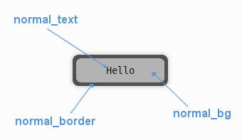

.. _theme-button:

UIButton Theming Parameters
===========================

.. raw:: html

    <video width="140" height="60" nocontrols playsinline autoplay muted loop>
        <source src="../_static/button.mp4" type="video/mp4">
        Your browser does not support the video tag.
    </video>

The :class:`UIButton <pygame_gui.elements.UIButton>` theming block id is 'button'.

Colours
-------

   A diagram of which part of the element is themed by which colour parameter. This correspondence is the same for the
   parameters named for the different button states e.g. the parameter 'hovered_bg' themes the same area as 'normal_bg'
   when the button is in the hovered state.

:class:`UIButton <pygame_gui.elements.UIButton>` makes use of these colour parameters in a 'colours' block. Most of
these colours can also be a colour gradient:

 - "**normal_bg**" - The background colour/gradient of the button in the default state.
 - "**hovered_bg**" - The background colour/gradient of the button when the mouse pointer is over it.
 - "**disabled_bg**" - The background colour/gradient of the button when the button has been disabled (so users cannot interact with it)
 - "**selected_bg**" - The background colour/gradient of the button when the button has select focus.
 - "**active_bg**" - The background colour/gradient of the button 'mid-click', you will mostly see it while dragging things around via buttons.
 - "**normal_text**" - The colour/gradient of the button's text in the default state.
 - "**hovered_text**" - The colour/gradient of the button's text when the mouse pointer is over it.
 - "**disabled_text**" - The colour/gradient of the button's text when the button has been disabled (so users cannot interact with it)
 - "**selected_text**" - The colour/gradient of the button's text when the button has select focus.
 - "**active_text**" - The colour/gradient of the button's text (if any) 'mid-click', you will mostly see it while dragging things around via buttons.
 - "**normal_border**" - The colour/gradient of the border around the button (if it has one), in the default state.
 - "**hovered_border**" - The colour/gradient of the border around the button (if it has one), in the hovered state.
 - "**disabled_border**" - The colour/gradient of the border around the button (if it has one), in the disabled state.
 - "**selected_border**" - The colour/gradient of the border around the button (if it has one), in the selected state.
 - "**active_border**" - The colour/gradient of the border around the button (if it has one), in the active state.
 - "**normal_text_shadow**" - The colour of the shadow behind the button's text (if it has one), in the default state.
 - "**hovered_text_shadow**" - The colour of the shadow behind the button's text (if it has one), in the hovered state.
 - "**disabled_text_shadow**" - The colour of the shadow behind the button's text (if it has one), in the disabled state.
 - "**selected_text_shadow**" - The colour of the shadow behind the button's text (if it has one), in the selected state.
 - "**active_text_shadow**" - The colour of the shadow behind the button's text (if it has one), in the active state.

Font
-----

:class:`UIButton <pygame_gui.elements.UIButton>` accepts a font specified in the theme via a 'font' block. A 'font'
block has these parameters:

 - "**name**" - Necessary to make a valid block. This is the name that this font goes by in the UI, if this is a new font then subsequent font instances with different styles or sizes should use the same name.
 - "**locale**" - Optional parameter to set this font as belonging to a particular locale only. See the :ref:`localization` guide. You will need to keep repeating the locale specifier if using prototypes to make a hierarchy.
 - "**size**" - Necessary to make a valid block. This is the point size of the font to use on the button.
 - "**bold**" - Optional parameter. Set it to "1" to make this font bold.
 - "**italic**" - Optional parameter. Set it to "1" to make this font italic.

There are two methods to refer to font resource locations. First, using packaged resources:

 - "**regular_resource** - The location of this font's file with no particular style applied.
    - **package** - The name of the python package containing this resource - e.g. 'data.fonts'
    - **resource** - The file name of the resource - e.g. 'FiraCode-Regular.ttf'
 - "**bold_resource**" - The location of this font's file with bold style applied.
    - **package** - The name of the python package containing this resource - e.g. 'data.fonts'
    - **resource** - The file name of the resource - e.g. 'FiraCode-Bold.ttf'
 - "**italic_resource**" - The location of this font's file with italic style applied.
    - **package** - The name of the python package containing this resource - e.g. 'data.fonts'
    - **resource** - The file name of the resource - e.g. 'FiraMono-Italic.ttf'
 - "**bold_italic_resource**" - The location of this font's file with bold and italic style applied.
    - **package** - The name of the python package containing this resource - e.g. 'data.fonts'
    - **resource** - The file name of the resource - e.g. 'FiraMono-BoldItalic.ttf'

Second using paths:

 - "**regular_path**" - The path to this font's file with no particular style applied.
 - "**bold_path**" - The path to this font's file with bold style applied.
 - "**italic_path**" - The path to this font's file with italic style applied.
 - "**bold_italic_path**" - The path to this font's file with bold and italic style applied.

You only need to specify locations if this is the first use of this font name in the GUI.

Images
-------

:class:`UIButton <pygame_gui.elements.UIButton>` accepts images specified in the theme via an 'images' block. The button supports both single-image and multi-image modes for enhanced visual effects.

**Single Image Mode (Legacy)**

For simple buttons with one image per state, use these parameters:

 - "**normal_image**" - The image displayed in the buttons default state. It has the following block of sub-parameters:

    - "**path**" - The string path to the image to be displayed. OR
    - "**package** - The name of the python package containing this resource - e.g. 'data.images'
    - "**resource** - The file name of the resource in the python package - e.g. 'splat.png' - Use a 'package' and 'resource' or a 'path' not both.
    - "**sub_surface_rect**" - An optional rectangle (described like "x,y,width,height") that will be used to grab a smaller portion of the image specified. This allows us to create many image surfaces from one image file.
    - "**premultiplied**" - Optional parameter to declare that a loaded image already contains premultiplied alpha and does not need premultiplying. Set to "1" to enable, "0" to disable (default).

 - "**hovered_image**" - The image displayed in the buttons hovered state. It has the following block of sub-parameters:

    - "**path**" - The string path to the image to be displayed. OR
    - "**package** - The name of the python package containing this resource - e.g. 'data.images'
    - "**resource** - The file name of the resource in the python package - e.g. 'splat.png' - Use a 'package' and 'resource' or a 'path' not both.
    - "**sub_surface_rect**" - An optional rectangle (described like "x,y,width,height") that will be used to grab a smaller portion of the image specified. This allows us to create many image surfaces from one image file.
    - "**premultiplied**" - Optional parameter to declare that a loaded image already contains premultiplied alpha and does not need premultiplying. Set to "1" to enable, "0" to disable (default).

 - "**selected_image**" - The image displayed in the buttons select focused state. It has the following block of sub-parameters:

    - "**path**" - The string path to the image to be displayed. OR
    - "**package** - The name of the python package containing this resource - e.g. 'data.images'
    - "**resource** - The file name of the resource in the python package - e.g. 'splat.png' - Use a 'package' and 'resource' or a 'path' not both.
    - "**sub_surface_rect**" - An optional rectangle (described like "x,y,width,height") that will be used to grab a smaller portion of the image specified. This allows us to create many image surfaces from one image file.
    - "**premultiplied**" - Optional parameter to declare that a loaded image already contains premultiplied alpha and does not need premultiplying. Set to "1" to enable, "0" to disable (default).

 - "**disabled_image**" - The image displayed in the buttons disabled state. It has the following block of sub-parameters:

    - "**path**" - The string path to the image to be displayed. OR
    - "**package** - The name of the python package containing this resource - e.g. 'data.images'
    - "**resource** - The file name of the resource in the python package - e.g. 'splat.png' - Use a 'package' and 'resource' or a 'path' not both.
    - "**sub_surface_rect**" - An optional rectangle (described like "x,y,width,height") that will be used to grab a smaller portion of the image specified. This allows us to create many image surfaces from one image file.
    - "**premultiplied**" - Optional parameter to declare that a loaded image already contains premultiplied alpha and does not need premultiplying. Set to "1" to enable, "0" to disable (default).

**Multi-Image Mode (New)**

For advanced buttons with layered visual effects, use these parameters to specify multiple images per state:

 - "**normal_images**" - A list of images displayed in the button's default state, rendered in layer order. Each image in the list has these sub-parameters:

    - "**id**" - A unique identifier for this image layer (e.g., "background", "icon", "border").
    - "**layer**" - The rendering layer order (lower numbers render first/behind, higher numbers render last/on top).
    - "**path**" - The string path to the image to be displayed. OR
    - "**package** - The name of the python package containing this resource - e.g. 'data.images'
    - "**resource** - The file name of the resource in the python package - e.g. 'splat.png' - Use a 'package' and 'resource' or a 'path' not both.
    - "**sub_surface_rect**" - An optional rectangle (described like "x,y,width,height") that will be used to grab a smaller portion of the image specified.
    - "**premultiplied**" - Optional parameter to declare that a loaded image already contains premultiplied alpha and does not need premultiplying. Set to "1" to enable, "0" to disable (default).

 - "**hovered_images**" - A list of images displayed in the button's hovered state. Uses the same sub-parameters as normal_images.

 - "**selected_images**" - A list of images displayed in the button's selected state. Uses the same sub-parameters as normal_images.

 - "**disabled_images**" - A list of images displayed in the button's disabled state. Uses the same sub-parameters as normal_images.

**Image Mode Notes:**

- The button automatically detects whether to use single-image or multi-image mode based on the parameters provided.
- Multi-image mode allows for complex visual effects like layered backgrounds, icons, glows, and overlays.
- Images are rendered in layer order (lowest layer number first), allowing precise control over visual composition.
- If a state doesn't specify images, it will fall back to the normal state images.
- Both modes are fully compatible with the "auto_scale_images" parameter for automatic image scaling.

Misc
----

:class:`UIButton <pygame_gui.elements.UIButton>` accepts the following miscellaneous parameters in a 'misc' block:

 - "**shape**" - Can be one of 'rectangle', 'rounded_rectangle' or 'ellipse'. Different shapes for this UI element.
 - "**shape_corner_radius**" - Only used if our shape is 'rounded_rectangle'. It sets the radius, or radii, used for the rounded corners. Use a single integer to set all corners to the same radius, or four integers separated by commas to set each corner individually.
 - "**border_width**" - the width in pixels of the border around the button. Defaults to 1.
 - "**shadow_width**" - the width in pixels of the shadow behind the button. Defaults to 2.
 - "**tool_tip_delay**" - time in seconds before the button's tool tip (if it has one) will appear. Default is "1.0".
 - "**text_horiz_alignment**" - Set to "left", "right" or "center". Controls the horizontal placement of the button text, if this button has any text. Default is "center".
 - "**text_vert_alignment**" - Set to "top", "bottom or "center". Controls the vertical placement of the button text, if this button has any text. Default is "center".
 - "**text_horiz_alignment_padding**" - If horizontal alignment is set to 'left' or 'right' this value will control the buffer between the edge of the button and where we start placing the text. Default is "1".
 - "**text_vert_alignment_padding**" - If vertical alignment is set to 'top' or 'bottom' this value will control the buffer between the edge of the button and where we start placing the text. Default is "1".
 - "**text_shadow_size**" - The increased size in pixels of the text's shadow/outline. Set to "0", "1" or "2", larger than that the effect breaks down and individual letters merge together. Defaults to "0", no shadow.
 - "**text_shadow_offset**" - Pixel offset in horizontal (x) and vertical (y) dimensions for where the text shadow is drawn. In the format "x,y". Defaults to "0,0".
 - "**auto_scale_images**" - Set to "1" to automatically scale provided theming images to fit the button size while maintaining aspect ratio. The images will be scaled to the largest size that fits within the button's rectangle. Defaults to "0" (disabled).
 - "**state_transitions**" - A block of parameters that define any fade transitions between button states. Normally buttons states visually change instantly, if you setup values here the button will instead fade from one state to the next. Transition definitions are one way, if you want to go in both directions, use two parameters. Transition parameters have this format:

   - "**startstate_targetstate**" - Can be set to any positive floating point value, representing the transition time in seconds.

Example
-------

Here are examples of button blocks in JSON theme files using the parameters described above.

**Single Image Mode Example:**

.. code-block:: json
   :caption: button_single_image.json
   :linenos:

    {
        "button":
        {
            "colours":
            {
                "normal_bg": "#25292e",
                "hovered_bg": "#35393e",
                "disabled_bg": "#25292e",
                "selected_bg": "#25292e",
                "active_bg": "#193784",
                "normal_text": "#c5cbd8",
                "hovered_text": "#FFFFFF",
                "selected_text": "#FFFFFF",
                "disabled_text": "#6d736f",
                "active_text": "#6d736f",
                "normal_border": "#AAAAAA",
                "hovered_border": "#B0B0B0",
                "disabled_border": "#808080",
                "selected_border": "#8080B0",
                "active_border": "#8080B0",
                "normal_text_shadow": "#10101070",
                "hovered_text_shadow": "#10101070",
                "disabled_text_shadow": "#10101070",
                "selected_text_shadow": "#10101070",
                "active_text_shadow": "#10101070"
            },
            "font":
            {
                "name": "montserrat",
                "size": "12",
                "bold": "0",
                "italic": "1",
                "regular_resource": {
                     "package": "data.fonts",
                     "resource": "Montserrat-Regular.ttf"
                },
                "bold_resource": {
                     "package": "data.fonts",
                     "resource": "Montserrat-Bold.ttf"
                },
                "italic_resource": {
                     "package": "data.fonts",
                     "resource": "Montserrat-Italic.ttf"
                },
                "bold_italic_resource": {
                     "package": "data.fonts",
                     "resource": "Montserrat-BoldItalic.ttf"
                },
            },
            "images":
            {
                "normal_image": {
                    "package": "data.images",
                    "resource": "buttons.png",
                    "sub_surface_rect": "0,0,32,32"
                },
                "hovered_image": {
                    "package": "data.images",
                    "resource": "buttons.png",
                    "sub_surface_rect": "32,0,32,32"
                },
                "selected_image": {
                    "package": "data.images",
                    "resource": "buttons.png",
                    "sub_surface_rect": "64,0,32,32"
                },
                "disabled_image": {
                    "package": "data.images",
                    "resource": "buttons.png",
                    "sub_surface_rect": "96,0,32,32"
                }

            },
            "misc":
            {
                "shape": "rounded_rectangle",
                "shape_corner_radius": "10,0,0,0",
                "border_width": "1",
                "shadow_width": "1",
                "tool_tip_delay": "1.0",
                "text_horiz_alignment": "left",
                "text_vert_alignment": "top",
                "text_horiz_alignment_padding": "10",
                "text_vert_alignment_padding": "5",
                "text_shadow_size": "1",
                "text_shadow_offset": "0,0",
                "auto_scale_images": "1",
                "state_transitions":
                {
                    "normal_hovered": "0.5",
                    "hovered_normal": "0.5"
                }
            }
        }
    }

**Multi-Image Mode Example:**

.. code-block:: json
   :caption: button_multi_image.json
   :linenos:

    {
        "button":
        {
            "colours":
            {
                "normal_text": "#FFFFFF",
                "hovered_text": "#FFFF00",
                "selected_text": "#00FF00",
                "disabled_text": "#808080"
            },
            "images":
            {
                "normal_images": [
                    {
                        "id": "background",
                        "path": "images/button_bg.png",
                        "layer": 0
                    },
                    {
                        "id": "icon",
                        "path": "images/button_icon.png",
                        "layer": 1
                    }
                ],
                "hovered_images": [
                    {
                        "id": "background",
                        "path": "images/button_bg.png",
                        "layer": 0
                    },
                    {
                        "id": "icon",
                        "path": "images/button_icon.png",
                        "layer": 1
                    },
                    {
                        "id": "glow_effect",
                        "path": "images/button_glow.png",
                        "layer": 2
                    }
                ],
                "selected_images": [
                    {
                        "id": "background_selected",
                        "path": "images/button_bg_selected.png",
                        "layer": 0
                    },
                    {
                        "id": "icon",
                        "path": "images/button_icon.png",
                        "layer": 1
                    }
                ],
                "disabled_images": [
                    {
                        "id": "background_disabled",
                        "path": "images/button_bg_disabled.png",
                        "layer": 0
                    }
                ]
            },
            "misc":
            {
                "auto_scale_images": "0",
                "state_transitions":
                {
                    "normal_hovered": "0.3",
                    "hovered_normal": "0.3"
                }
            }
        }
    }
