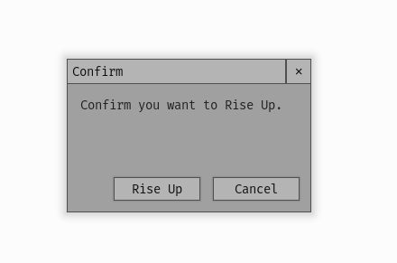

.. _theme-confirmation-dialog:

UIConfirmationDialog Theming Parameters
=======================================

:class:`UIConfirmationDialog <pygame_gui.windows.UIConfirmationDialog>` is a UIWindow with the element id of
'confirmation_dialog' and a default object id of '#confirmation_dialog'.

   An image of the Confirmation Dialog.

Inherited Parameters
--------------------

As a UIWindow the Confirmation Dialog has all the theming parameters of the UIWindow, which you can read more about here
:ref:`theme-window`.

Sub-elements
------------

As well as the sub-elements of the UIWindow (title bar and close button) which you can read about here
:ref:`theme-window`, the Confirmation Dialog has the following sub element IDs -

UIButtons:

 - 'confirmation_dialog.#confirm_button'
 - 'confirmation_dialog.#cancel_button'

UITextBox:

 - 'confirmation_dialog.text_box'

You can find out more about theming buttons here: :ref:`theme-button` and text boxes here: :ref:`theme-text-box`.