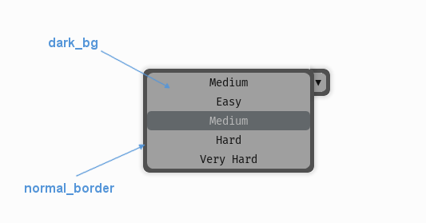

.. _theme-drop-down-menu:

UIDropDownMenu Theming Parameters
=================================

.. raw:: html

    <video width="240" height="100" nocontrols playsinline autoplay muted loop>
        <source src="../_static/drop_down_menu.mp4" type="video/mp4">
        Your browser does not support the video tag.
    </video>

The :class:`UIDropDownMenu <.UIDropDownMenu>` theming block id is 'drop_down_menu'.

Colours
-------

   A diagram of which part of the element is themed by which colour parameter. In the drop down menu it will only be
   possible to see the 'dark_bg' themed regions when the buttons in the menu are themed to be transparent, or semi
   transparent themselves.

:class:`UIDropDownMenu <.UIDropDownMenu>` makes use of these colour parameters in a 'colours' block. All of these colours can
also be a colour gradient:

 - "**dark_bg**" - The background colour/gradient of the drop down menu. Probably not visible.
 - "**normal_border**" - The border colour/gradient of the drop down menu.

Misc
----

:class:`UIDropDownMenu <.UIDropDownMenu>` accepts the following miscellaneous parameters in a 'misc' block:

 - "**shape**" - Can be one of 'rectangle' or 'rounded_rectangle'. Different shapes for this UI element.
 - "**shape_corner_radius**" - Only used if our shape is 'rounded_rectangle'. It sets the radius used for the rounded corners.
 - "**expand_direction**" - Can be set to **'up'** or **'down'**. Defaults to 'down'. Changing this parameter will change the direction that the menu will expand away from the initial starting point.
 - "**border_width**" - the width in pixels of the border around the drop down menu. Defaults to 1.
 - "**shadow_width**" - the width in pixels of the shadow behind the button. Defaults to 1.

Sub-elements
--------------

You can reference all of the buttons that are sub elements of the drop down menu with a theming block id of
'drop_down_menu.button'. You can also reference the buttons individually by adding their object IDs:

 - 'drop_down_menu.#expand_button'
 - 'drop_down_menu.#selected_option'
 - 'drop_down_menu.#option'

There is more information on theming buttons at :ref:`theme-button`.

Example
-------

Here is an example of a drop down menu block in a JSON theme file, using the parameters described above (and a couple from UIButton).

.. code-block:: json
   :caption: drop_down_menu.json
   :linenos:

    {
        "drop_down_menu":
        {
            "misc":
            {
                "expand_direction": "down"
            },

            "colours":
            {
                "normal_bg": "#25292e",
                "hovered_bg": "#35393e"
            }
        },
        "drop_down_menu.#selected_option":
        {
            "misc":
            {
               "border_width": "1"
            }
        }
    }
