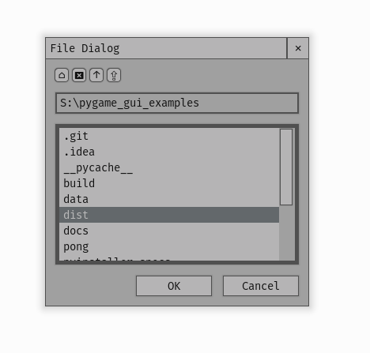

.. _theme-file-dialog:

UIFileDialog Theming Parameters
===============================

:class:`UIFileDialog <pygame_gui.windows.UIFileDialog>` is a UIWindow with the object id of '#file_dialog'.

   An image of the File Dialog window.

Inherited Parameters
--------------------

As a UIWindow the File Dialog has all the theming parameters of the UIWindow, which you can read more about here
:ref:`theme-window`.

Sub-elements
------------

As well as the sub-elements of the UIWindow (title bar and close button) which you can read about here
:ref:`theme-window`, the file dialog has the following sub element IDs -

UIButtons:

 - '#file_dialog.#ok_button'
 - '#file_dialog.#cancel_button'
 - '#file_dialog.#home_icon_button'
 - '#file_dialog.#delete_icon_button'
 - '#file_dialog.#parent_icon_button'
 - '#file_dialog.#refresh_icon_button'

UITextEntryLine:

 - '#file_dialog.#file_path_text_line'

UISelectionList:

 - '#file_dialog.#file_display_list'

You can find out more about theming buttons here: :ref:`theme-button`, text entry lines here: :ref:`theme-text-entry-line`
and selection lists here: :ref:`theme-selection-list`.
