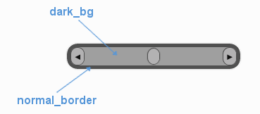

.. _theme-horizontal-slider:

UIHorizontalSlider Theming Parameters
=====================================

.. raw:: html

    <video width="340" height="64" nocontrols playsinline autoplay muted loop>
        <source src="../_static/horizontal_slider.mp4" type="video/mp4">
        Your browser does not support the video tag.
    </video>

The :class:`UIHorizontalSlider <pygame_gui.elements.UIHorizontalSlider>` theming block id is 'horizontal_slider'.

Colours
-------

   A diagram of which part of the element is themed by which colour parameter. The slider's buttons are themed in a
   separate block.

:class:`UIHorizontalSlider <pygame_gui.elements.UIHorizontalSlider>` makes use of these colour parameters in a 'colours' block. All of these colours can
also be a colour gradient:

 - "**dark_bg**" - The background colour/gradient of the 'back' of the slider, the colour of the track that the sliding part moves along.
 - "**normal_border**" - The border colour/gradient of the slider.
 - "**disabled_dark_bg**" - The colour/gradient of the track when disabled.
 - "**disabled_border**" - The border colour/gradient of the slider when disabled.

Misc
----

:class:`UIHorizontalSlider <pygame_gui.elements.UIHorizontalSlider>` accepts the following miscellaneous parameters in a 'misc' block:

 - "**shape**" - Can be one of 'rectangle' or 'rounded_rectangle'. Different shapes for this UI element.
 - "**shape_corner_radius**" - Only used if our shape is 'rounded_rectangle'. It sets the radius used for the rounded corners.
 - "**border_width**" - the width in pixels of the border around the slider. Defaults to 1.
 - "**shadow_width**" - the width in pixels of the shadow behind the slider. Defaults to 1.
 - "**enable_arrow_buttons**" - Enables or disables the arrow buttons for the slider. "1" is enabled, "0" is disabled. Defaults to "1".
 - "**sliding_button_width**" - Sets the width of the sliding button. Defaults to "20".

Sub-elements
--------------

You can reference all of the buttons that are sub elements of the slider with a theming block id of
'horizontal_slider.button'. You can reference both of the arrow buttons with the class_id: '@arrow_button'.
 You can also reference the buttons individually by adding their object IDs:

 - 'horizontal_slider.#left_button'
 - 'horizontal_slider.#right_button'
 - 'horizontal_slider.#sliding_button'

There is more information on theming buttons at :ref:`theme-button`.

Example
-------

Here is an example of a horizontal slider block in a JSON theme file, using the parameters described above (and some from UIButton).

.. code-block:: json
   :caption: horizontal_slider.json
   :linenos:

    {
        "horizontal_slider":
        {
            "colours":
            {
                "normal_bg": "#25292e",
                "hovered_bg": "#35393e",
                "disabled_bg": "#25292e",
                "selected_bg": "#25292e",
                "active_bg": "#193784",
                "dark_bg": "#15191e,#202020,0",
                "normal_text": "#c5cbd8",
                "hovered_text": "#FFFFFF",
                "selected_text": "#FFFFFF",
                "disabled_text": "#6d736f"
            },
            "misc":
            {
               "shape": "rectangle",
               "enable_arrow_buttons": "0",
               "sliding_button_width": "15"
            }
        },
        "horizontal_slider.button":
        {
            "misc":
            {
               "border_width": "1"
            }
        },
        "horizontal_slider.#sliding_button":
        {
            "colours":
            {
               "normal_bg": "#FF0000"
            }
        }
    }