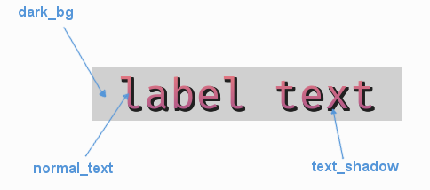

.. _theme-label:

UILabel Theming Parameters
==========================

The :class:`UILabel <pygame_gui.elements.UILabel>` theming block id is 'label'.

Colours
-------

   A diagram of which part of the element is themed by which colour parameter. The text shadow **cannot** be themed
   with a colour gradient.

:class:`UILabel <pygame_gui.elements.UILabel>` makes use of these colour parameters in a 'colours' block. Most of these colours can
also be a colour gradient:

 - "**dark_bg**" - The background colour/gradient of the label text.
 - "**normal_text**" - The colour/gradient of the text itself.
 - "**text_shadow**" - The colour of the shadow behind the text, if any exists.

Font
-----

:class:`UILabel <pygame_gui.elements.UILabel>` accepts a font specified in the theme via a 'font' block. A 'font' block has these parameters:

 - "**name**" - Necessary to make a valid block. This is the name that this font goes by in the UI, if this is a new font then subsequent font instances with different styles or sizes should use the same name.
 - "**size**" - Necessary to make a valid block. This is the point size of the font to use on the label.
 - "**bold**" - Optional parameter. Set it to "1" to make this font bold.
 - "**italic**" - Optional parameter. Set it to "1" to make this font italic.

Only specify paths if this is the first use of this font name in the GUI:

 - "**regular_path**" - The path to this font's file with no particular style applied.
 - "**bold_path**" - The path to this font's file with bold style applied.
 - "**italic_path**" - The path to this font's file with italic style applied.
 - "**bold_italic_path**" - The path to this font's file with bold and italic style applied.

Misc
-----

:class:`UILabel <pygame_gui.elements.UILabel>` has the following miscellaneous parameters in a 'misc' block:

 - "**text_shadow**" - Set to "1" to enable, or "0" to disable a shadow/outline behind the text. Defaults to "0".
 - "**text_shadow_size**" - The increased size in pixels of the shadow/outline. Set to "0", "1" or "2", larger than that the effect breaks down and individual letters merge together.
 - "**text_shadow_offset**" - Pixel offset in horizontal (x) and vertical (y) dimensions for where the shadow is drawn. In the format "x,y". Defaults to "0,0".

Example
-------

Here is an example of a label block in a JSON theme file using the parameters described above.

.. code-block:: json
   :caption: label.json
   :linenos:

    {
        "label":
        {
            "colours":
            {
                "dark_bg": "#25292e",
                "normal_text": "#c5cbd8",
                "text_shadow": "#505050"
            },
            "font":
            {
                "name": "montserrat",
                "size": "12",
                "bold": "0",
                "italic": "0"
            },
            "misc":
            {
                "text_shadow": "1",
                "text_shadow_size": "1",
                "text_shadow_offset": "0,0"
            }
        }
    }
