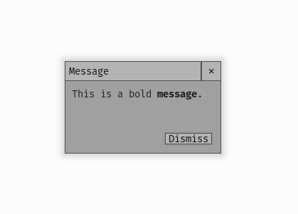

.. _theme-message-window:

UIMessageWindow Theming Parameters
=======================================

:class:`UIMessageWindow <pygame_gui.windows.UIMessageWindow>` is a UIWindow with the object id of '#message_window'.

   An image of the Message Window.

Inherited Parameters
--------------------

As a UIWindow the Message Window has all the theming parameters of the UIWindow, which you can read more about here
:ref:`theme-window`.

Sub-elements
------------

As well as the sub-elements of the UIWindow (title bar and close button) which you can read about here
:ref:`theme-window`, the message window has the following sub element IDs -

UIButtons:

 - '#message_window.#dismiss_button'

UITextBox:

 - '#message_window.text_box'

You can find out more about theming buttons here: :ref:`theme-button` and text boxes here: :ref:`theme-text-box`.
