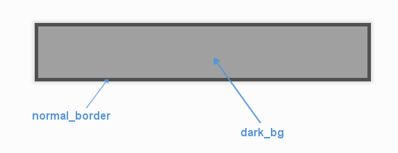

.. _theme-panel:

UIPanel Theming Parameters
==========================

The :class:`UIPanel <pygame_gui.elements.UIPanel>` theming block id is 'panel'.

Colours
-------

   A diagram of which part of the element is themed by which colour parameter.

:class:`UIPanel <pygame_gui.elements.UIPanel>` makes use of the following these colour parameters in a 'colours' block.
All of these colours can also be a colour gradient:

 - "**dark_bg**" -  The background colour/gradient of the panel element.
 - "**normal_border**" - The colour/gradient of the border around the panel (if it has one).

Images
-------

:class:`UIPanel <pygame_gui.elements.UIPanel>` accepts images specified in the theme via an 'images' block. The panel supports both single-image and multi-image modes for enhanced visual effects.

**Single Image Mode (Legacy)**

For simple panels with one background image, use this parameter:

 - "**background_image**" - The image displayed on the panel. It has the following block of sub-parameters:

    - "**path**" - The string path to the image to be displayed. OR
    - "**package** - The name of the python package containing this resource - e.g. 'data.images'
    - "**resource** - The file name of the resource in the python package - e.g. 'splat.png' - Use a 'package' and 'resource' or a 'path' not both.
    - "**sub_surface_rect**" - An optional rectangle (described like "x,y,width,height") that will be used to grab a smaller portion of the image specified. This allows us to create many image surfaces from one image file.
    - "**premultiplied**" - Optional parameter to declare that a loaded image already contains premultiplied alpha and does not need premultiplying. Set to "1" to enable, "0" to disable (default).

**Multi-Image Mode (New)**

For advanced panels with layered visual effects, use this parameter to specify multiple background images:

 - "**background_images**" - A list of images displayed on the panel, rendered in layer order. Each image in the list has these sub-parameters:

    - "**id**" - A unique identifier for this image layer (e.g., "background", "texture", "overlay").
    - "**layer**" - The rendering layer order (lower numbers render first/behind, higher numbers render last/on top).
    - "**path**" - The string path to the image to be displayed. OR
    - "**package** - The name of the python package containing this resource - e.g. 'data.images'
    - "**resource** - The file name of the resource in the python package - e.g. 'splat.png' - Use a 'package' and 'resource' or a 'path' not both.
    - "**sub_surface_rect**" - An optional rectangle (described like "x,y,width,height") that will be used to grab a smaller portion of the image specified.
    - "**premultiplied**" - Optional parameter to declare that a loaded image already contains premultiplied alpha and does not need premultiplying. Set to "1" to enable, "0" to disable (default).

**Image Mode Notes:**

- The panel automatically detects whether to use single-image or multi-image mode based on the parameters provided.
- Multi-image mode allows for complex visual effects like layered backgrounds, textures, patterns, and overlays.
- Images are rendered in layer order (lowest layer number first), allowing precise control over visual composition.
- Both modes are fully compatible with panel scaling and positioning.

Misc
----

:class:`UIPanel <pygame_gui.elements.UIPanel>` accepts the following miscellaneous parameters in a 'misc' block:

 - "**shape**" - Can be one of 'rectangle' or 'rounded_rectangle'. Different shapes for this UI element.
 - "**shape_corner_radius**" - Only used if our shape is 'rounded_rectangle'. It sets the radius, or radii, used for the rounded corners. Use a single integer to set all corners to the same radius, or four integers separated by commas to set each corner individually.
 - "**border_width**" - The width of the border around the element in pixels. Defaults to "1".
 - "**shadow_width**" - The width of the shadow around the element in pixels. Defaults to "2".
 - "**tool_tip_delay**" - time in seconds before the button's tool tip (if it has one) will appear. Default is "1.0".

Example
-------

Here are examples of panel blocks in JSON theme files using the parameters described above.

**Single Image Mode Example:**

.. code-block:: json
   :caption: panel_single_image.json
   :linenos:

    {
        "panel":
        {
            "colours":
            {
                "dark_bg":"#21282D",
                "normal_border": "#999999"
            },
            "images":
            {
                "background_image":
                {
                    "package": "data.images",
                    "resource": "splat.png",
                    "sub_surface_rect": "0,0,32,32"
                }
            },
            "misc":
            {
                "shape": "rounded_rectangle",
                "shape_corner_radius": "10",
                "border_width": "1",
                "shadow_width": "15"
            }
        }
    }

**Multi-Image Mode Example:**

.. code-block:: json
   :caption: panel_multi_image.json
   :linenos:

    {
        "panel":
        {
            "colours":
            {
                "dark_bg":"#21282D",
                "normal_border": "#999999"
            },
            "images":
            {
                "background_images": [
                    {
                        "id": "base_texture",
                        "path": "images/panel_base.png",
                        "layer": 0
                    },
                    {
                        "id": "pattern_overlay",
                        "path": "images/panel_pattern.png",
                        "layer": 1
                    },
                    {
                        "id": "border_decoration",
                        "path": "images/panel_border.png",
                        "layer": 2
                    }
                ]
            },
            "misc":
            {
                "shape": "rounded_rectangle",
                "shape_corner_radius": "10",
                "border_width": "1",
                "shadow_width": "15"
            }
        }
    }
