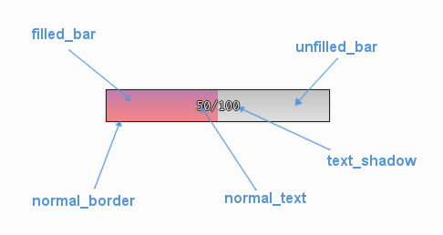

.. _progress-bar:

UIProgressBar Theming Parameters
=========================================

.. raw:: html

    <video width="240" height="44" nocontrols playsinline autoplay muted loop>
        <source src="../_static/screen_space_health_bar.mp4" type="video/mp4">
        Your browser does not support the video tag.
    </video>

The :class:`UIProgressBar <pygame_gui.elements.UIProgressBar>` theming block id is 'progress_bar'.

Colours
-------

   A diagram of which part of the element is themed by which colour parameter. The text shadow **cannot** be themed
   with a colour gradient.

:class:`UIProgressBar <pygame_gui.elements.UIProgressBar>` makes use of these colour parameters in a 'colours' block. Most of these colours can
also be a colour gradient:

 - "**normal_text**" - The colour/gradient of the health bars's text.
 - "**text_shadow**" - The colour of the shadow behind the text (so it stands out better).
 - "**normal_border**" - The colour/gradient of the border around the health bar.
 - "**filled_bar**" - The colour/gradient of the actual bar itself, of the portion of it that is still full.
 - "**unfilled_bar**" - The colour/gradient of an empty portion of the health bar.

Misc
----

:class:`UIProgressBar <pygame_gui.elements.UIProgressBar>` accepts the following miscellaneous parameters in a 'misc' block:

 - "**shape**" - Can be one of 'rectangle' or 'rounded_rectangle'. Different shapes for this UI element.
 - "**shape_corner_radius**" - Only used if our shape is 'rounded_rectangle'. It sets the radius, or radii, used for the rounded corners. Use a single integer to set all corners to the same radius, or four integers separated by commas to set each corner individually.
 - "**border_width**" - the width in pixels of the border around the bar. Defaults to 1.
 - "**shadow_width**" - the width in pixels of the shadow behind the bar. Defaults to 1.
 - "**tool_tip_delay**" - time in seconds before the button's tool tip (if it has one) will appear. Default is "1.0".

Font
-----

:class:`UIProgressBar <pygame_gui.elements.UIProgressBar>` accepts a font specified in the theme via a 'font' block. A 'font' block has these parameters:

 - "**name**" - Necessary to make a valid block. This is the name that this font goes by in the UI, if this is a new font then subsequent font instances with different styles or sizes should use the same name.
 - "**locale**" - Optional parameter to set this font as belonging to a particular locale only. See the :ref:`localization` guide. You will need to keep repeating the locale specifier if using prototypes to make a hierarchy.
 - "**size**" - Necessary to make a valid block. This is the point size of the font to use on the health bar.
 - "**bold**" - Optional parameter. Set it to "1" to make this font bold.
 - "**italic**" - Optional parameter. Set it to "1" to make this font italic.

There are two methods to refer to font resource locations. First, using packaged resources:

 - "**regular_resource** - The location of this font's file with no particular style applied.
    - **package** - The name of the python package containing this resource - e.g. 'data.fonts'
    - **resource** - The file name of the resource - e.g. 'FiraCode-Regular.ttf'
 - "**bold_resource**" - The location of this font's file with bold style applied.
    - **package** - The name of the python package containing this resource - e.g. 'data.fonts'
    - **resource** - The file name of the resource - e.g. 'FiraCode-Bold.ttf'
 - "**italic_resource**" - The location of this font's file with italic style applied.
    - **package** - The name of the python package containing this resource - e.g. 'data.fonts'
    - **resource** - The file name of the resource - e.g. 'FiraMono-Italic.ttf'
 - "**bold_italic_resource**" - The location of this font's file with bold and italic style applied.
    - **package** - The name of the python package containing this resource - e.g. 'data.fonts'
    - **resource** - The file name of the resource - e.g. 'FiraMono-BoldItalic.ttf'

Second using paths:

 - "**regular_path**" - The path to this font's file with no particular style applied.
 - "**bold_path**" - The path to this font's file with bold style applied.
 - "**italic_path**" - The path to this font's file with italic style applied.
 - "**bold_italic_path**" - The path to this font's file with bold and italic style applied.

You only need to specify locations if this is the first use of this font name in the GUI.

Example
-------

Here is an example of a progress bar block in a JSON theme file using the parameters described above.

.. code-block:: json
   :caption: progress_bar.json
   :linenos:

    {
        "progress_bar":
        {
            "colours":
            {
                "normal_text": "#c5cbd8",
                "text_shadow": "#777777",
                "normal_border": "#DDDDDD",
                "filled_bar": "#f4251b,#A4150b,180",
                "unfilled_bar": "#CCCCCC"
            },
            "font":
            {
                "name": "montserrat",
                "size": "12",
                "bold": "0",
                "italic": "1"
            }
        }
    }
