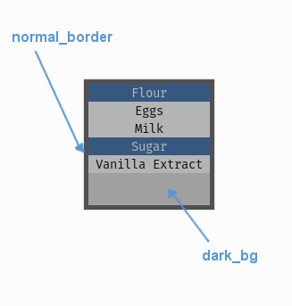

.. _theme-selection-list:

UISelectionList Theming Parameters
==================================

:class:`UISelectionList <pygame_gui.elements.UISelectionList>` theming block id is 'selection_list'.

Colours
-------

   A diagram of which part of the element is themed by which colour parameter.

:class:`UISelectionList <pygame_gui.elements.UISelectionList>` makes use of the following these colour parameters in
a 'colours' block. All of these colours can also be a colour gradient:

 - "**dark_bg**" -  The background colour/gradient of the selection list element. Often you won't see this unless your list buttons are semi-transparent.
 - "**normal_border**" - The colour/gradient of the border around the selection list (if it has one).

Misc
----

:class:`UISelectionList <pygame_gui.elements.UISelectionList>` accepts the following miscellaneous parameters in a 'misc' block:

 - "**shape**" - Can be one of 'rectangle' or 'rounded_rectangle'. Different shapes for this UI element.
 - "**shape_corner_radius**" - Only used if our shape is 'rounded_rectangle'. It sets the radius used for the rounded corners. Defaults to "2".
 - "**border_width**" - The width of the border around the element in pixels. Defaults to "1".
 - "**shadow_width**" - The width of the shadow around the element in pixels. Defaults to "2".
 - "**list_item_height**" - The pixel height of a the items in the list. Defaults to "20".

Example
-------

Here is an example of a panel block in a JSON theme file, using the parameters described above.

.. code-block:: json
   :caption: selection_list.json
   :linenos:

    {
        "selection_list":
        {
            "colours":
            {
                "dark_bg":"#21282D",
                "border": "#999999"
            },

            "background_image":
            {
                "path": "data/images/splat.png",
                "sub_surface_rect": "0,0,32,32"
            },

            "misc":
            {
                "shape": "rounded_rectangle",
                "shape_corner_radius": "10",
                "border_width": "1",
                "shadow_width": "15",
                "list_item_height": "30"
            }
        }
    }
