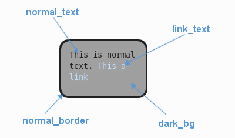

.. _theme-text-box:

UITextBox Theming Parameters
============================

.. raw:: html

    <video width="220" height="220" nocontrols playsinline autoplay muted loop>
        <source src="../_static/text_box.mp4" type="video/mp4">
        Your browser does not support the video tag.
    </video>

The :class:`UITextBox <pygame_gui.elements.UITextBox>` theming block id is 'text_box'.

Colours
-------

   A diagram of which part of the element is themed by which colour parameter. This correspondence is the same for the
   parameters named for the different link states e.g. the parameter 'link_hover' themes the same text as 'link_text'
   when the link is in the hovered state.

:class:`UITextBox <pygame_gui.elements.UITextBox>` makes use of these colour parameters in a 'colours' block. All of these colours can
also be a colour gradient:

 - "**dark_bg**" -  The background colour/gradient of the text box element.
 - "**normal_border**" - The colour/gradient of the border around the text box element.
 - "**link_text**" - The default colour/gradient of any links in the text.
 - "**link_hover**" - The colour/gradient of link text when we hover over it with the mouse.
 - "**link_selected**" - The colour/gradient of link text when they are clicked on with the mouse.

Misc
----

:class:`UITextBox <pygame_gui.elements.UITextBox>` accepts the following miscellaneous parameters in a 'misc' block:

 - "**shape**" - Can be one of 'rectangle' or 'rounded_rectangle'. Different shapes for this UI element.
 - "**shape_corner_radius**" - Only used if our shape is 'rounded_rectangle'. It sets the radius used for the rounded corners.
 - "**border_width**" - The width of the border around the element in pixels. Defaults to "1".
 - "**shadow_width**" - The width of the shadow around the element in pixels. Defaults to "2".
 - "**padding**" - the horizontal and vertical 'padding' between the border and where we render the text. Defaults to "5,5".
 - "**link_normal_underline**" - Set to either "1" or "0". Whether link text is normally underlined. Defaults to "0" (False).
 - "**link_hover_underline**" - Set to either "1" or "0". Whether link text is underlined when they are hovered over with the mouse. Defaults to "1" (True).
 - "**text_horiz_alignment**" - Set to "default, "left", "right" or "center". Controls the horizontal placement of all the text box text. Default is "default" which will use any in-text alignment set, all other values will override any in-text formatting.
 - "**text_vert_alignment**" - Set to "default", "top", "bottom or "center". Controls the vertical placement of the text box text. Default is "default" which will use any in-text alignment set, all other values will override any in-text formatting.
 - "**text_horiz_alignment_padding**" - If horizontal alignment is set to 'left' or 'right' this value will control the buffer between the edge of the box padding and where we start placing the text. Default is "0". Using "padding" is better but these parameters are included for completeness.
 - "**text_vert_alignment_padding**" - If vertical alignment is set to 'top' or 'bottom' this value will control the buffer between the edge of the box padding and where we start placing the text. Default is "0". Using "padding" is better but these parameters are included for completeness.
 - "**line_spacing**" - Sets the spacing of lines of text. The default is 1.25.
 - "**tool_tip_delay**" - time in seconds before the button's tool tip (if it has one) will appear. Default is "1.0".

Sub-elements
--------------

The text box may also contain a :class:`UIVerticalScrollBar <pygame_gui.elements.UIVerticalScrollBar>` which you can reference with the block id
'text_box.vertical_scroll_bar'. You can also reference all of the buttons that are sub elements of the
scroll bar with a theming block id of 'text_box.vertical_scroll_bar.button'.

You can further reference the individual buttons of the scroll bar by adding their object IDs:

 - 'text_box.vertical_scroll_bar.#top_button'
 - 'text_box.vertical_scroll_bar.#bottom_button'
 - 'text_box.vertical_scroll_bar.#sliding_button'

There is more information on theming the vertical scroll bar at :ref:`theme-vertical-scroll-bar`.

Example
-------

Here is an example of a text box block in a JSON theme file, using the parameters described above.

.. code-block:: json
   :caption: text_box.json
   :linenos:

    {
        "text_box":
        {
            "colours":
            {
                "dark_bg":"#21282D",
                "normal_border": "#999999",
                "link_text": "#FF0000",
                "link_hover": "#FFFF00",
                "link_selected": "#FFFFFF"
            },

            "misc":
            {
                "border_width": "1",
                "padding": "10,10",
                "link_normal_underline": "0",
                "link_hover_underline": "1",
                "line_spacing": "1.0"
            }
        },
        "text_box.vertical_scroll_bar":
        {
            "colours":
            {
               "dark_bg": "#505068"
            }
        },
        "text_box.vertical_scroll_bar.#sliding_button":
        {
            "misc":
            {
               "border_width": "1"
            }
        }
    }