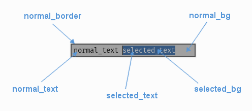

.. _theme-text-entry-line:

UITextEntryLine Theming Parameters
===================================

.. raw:: html

    <video width="240" height="44" nocontrols playsinline autoplay muted loop>
        <source src="../_static/text_entry_line.mp4" type="video/mp4">
        Your browser does not support the video tag.
    </video>

The :class:`UITextEntryLine <pygame_gui.elements.UITextEntryLine>` theming block id is 'text_entry_line'.

Colours
-------

   A diagram of which part of the element is themed by which colour parameter.

:class:`UITextEntryLine <pygame_gui.elements.UITextEntryLine>` makes use of these colour parameters in a 'colours' block. All of these colours can
also be a colour gradient except the text cursor:

 - "**dark_bg**" -  The default colour/gradient of the background to the entry line element.
 - "**selected_bg**" - The colour/gradient the background changes to when the text above it is selected.
 - "**normal_text**" - The default colour/gradient of text entered into the element.
 - "**selected_text**" - The colour/gradient of text when it has been selected.
 - "**normal_border**" - The colour/gradient of the border around the text entry element.
 - "**text_cursor**" - The colour of the text cursor.

Font
-----

:class:`UITextEntryLine <pygame_gui.elements.UITextEntryLine>` accepts a font specified in the theme via a 'font' block. A 'font' block has these parameters:

 - "**name**" - Necessary to make a valid block. This is the name that this font goes by in the UI, if this is a new font then subsequent font instances with different styles or sizes should use the same name.
 - "**locale**" - Optional parameter to set this font as belonging to a particular locale only. See the :ref:`localization` guide. You will need to keep repeating the locale specifier if using prototypes to make a hierarchy.
 - "**size**" - Necessary to make a valid block. This is the point size of the font to use on the text entry line.
 - "**bold**" - Optional parameter. Set it to "1" to make this font bold.
 - "**italic**" - Optional parameter. Set it to "1" to make this font italic.

There are two methods to refer to font resource locations. First, using packaged resources:

 - "**regular_resource** - The location of this font's file with no particular style applied.
    - **package** - The name of the python package containing this resource - e.g. 'data.fonts'
    - **resource** - The file name of the resource - e.g. 'FiraCode-Regular.ttf'
 - "**bold_resource**" - The location of this font's file with bold style applied.
    - **package** - The name of the python package containing this resource - e.g. 'data.fonts'
    - **resource** - The file name of the resource - e.g. 'FiraCode-Bold.ttf'
 - "**italic_resource**" - The location of this font's file with italic style applied.
    - **package** - The name of the python package containing this resource - e.g. 'data.fonts'
    - **resource** - The file name of the resource - e.g. 'FiraMono-Italic.ttf'
 - "**bold_italic_resource**" - The location of this font's file with bold and italic style applied.
    - **package** - The name of the python package containing this resource - e.g. 'data.fonts'
    - **resource** - The file name of the resource - e.g. 'FiraMono-BoldItalic.ttf'

Second using paths:

 - "**regular_path**" - The path to this font's file with no particular style applied.
 - "**bold_path**" - The path to this font's file with bold style applied.
 - "**italic_path**" - The path to this font's file with italic style applied.
 - "**bold_italic_path**" - The path to this font's file with bold and italic style applied.

You only need to specify locations if this is the first use of this font name in the GUI.

Misc
----

:class:`UITextEntryLine <pygame_gui.elements.UITextEntryLine>` accepts the following miscellaneous parameters in a 'misc' block:

 - "**shape**" - Can be one of 'rectangle' or 'rounded_rectangle'. Different shapes for this UI element.
 - "**shape_corner_radius**" - Only used if our shape is 'rounded_rectangle'. It sets the radius used for the rounded corners.
 - "**border_width**" - the width of the border around the element in pixels. Defaults to "1".
 - "**shadow_width**" - the width of the shadow around the element in pixels. Defaults to "1".
 - "**padding**" - the horizontal and vertical 'padding' between the border and where we render the text. Defaults to "4,2".

Example
-------

Here is an example of a text entry line block in a JSON theme file using all the parameters described above.

.. code-block:: json
   :caption: text_entry_line.json
   :linenos:

    {
        "text_entry_line":
        {
            "colours":
            {
                "dark_bg": "#25292e",
                "selected_bg": "#55595e",
                "normal_text": "#AAAAAA",
                "selected_text": "#FFFFFF",
                "normal_border": "#FFFFFF"
            },
            "font":
            {
                "name": "montserrat",
                "size": "12",
                "bold": "0",
                "italic": "1",
                "regular_resource": {
                     "package": "data.fonts",
                     "resource": "Montserrat-Regular.ttf"
                },
                "bold_resource": {
                     "package": "data.fonts",
                     "resource": "Montserrat-Bold.ttf"
                },
                "italic_resource": {
                     "package": "data.fonts",
                     "resource": "Montserrat-Italic.ttf"
                },
                "bold_italic_resource": {
                     "package": "data.fonts",
                     "resource": "Montserrat-BoldItalic.ttf"
                },
            },
            "misc":
            {
                "shape": "rounded_rectangle",
                "shape_corner_radius": 5,
                "border_width": "2",
                "shadow_width": "2",
                "padding": "6,4"
            }
        }
    }
